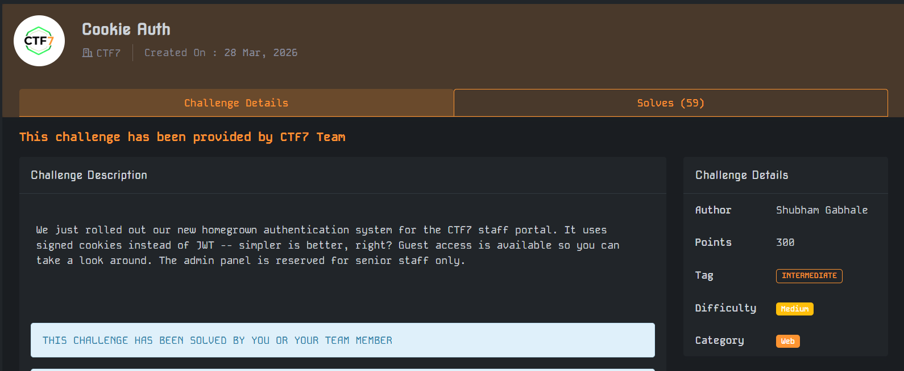

start the lab
open the link in browser
in the inspect dev tools of the browser in the elements tab
in the html inside the body tag we see a comment

<!-- debug: auth_secret=supersecretkey -->

so we login with guest account with username as guest and password as guest

we see in the application tab in dev tools that a cookie was set with key
session_token and some value

we need to create a new admin level cookie

since with the source hint on the html page we got to know the hash algo is md5
we used cyberchef to encode the string "supersecretkeyadminadmin"
with username as admin and role as admin

now we draft a json with
{"username": "admin", "role": "admin", "sig": "0d8c2e6689872693269b13a38f9ad12b"}

and then convert this json in base64 and set it as the value of the cookie

and then reload the page and get to admin panel link and then we got the flag
