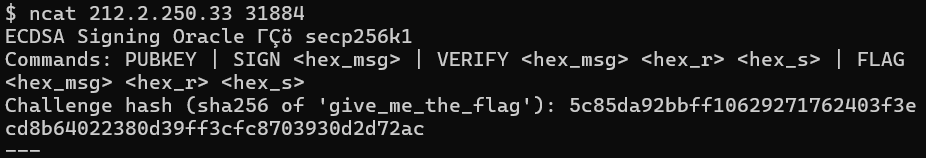
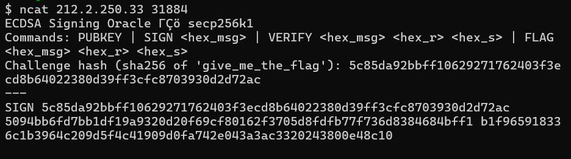
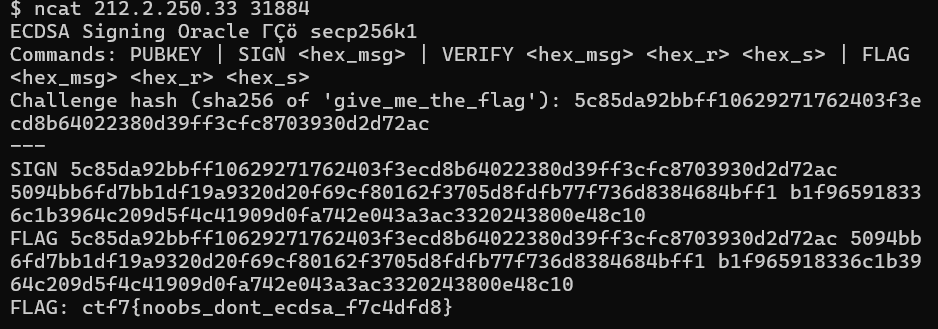

open the lab
get the ip and port
open command prompt
install nmap using winget

and use ncat command

ncat 212.2.250.33 31884

type SIGN 5c85da92bbff10629271762403f3ecd8b64022380d39ff3cfc8703930d2d72ac

then type
FLAG 5c85da92bbff10629271762403f3ecd8b64022380d39ff3cfc8703930d2d72ac 5094bb6fd7bb1df19a9320d20f69cf80162f3705d8fdfb77f736d8384684bff1 b1f965918336c1b3964c209d5f4c41909d0fa742e043a3ac3320243800e48c10

output as follows

we got the flag
FLAG: ctf7{noobs_dont_ecdsa_f7c4dfd8}
