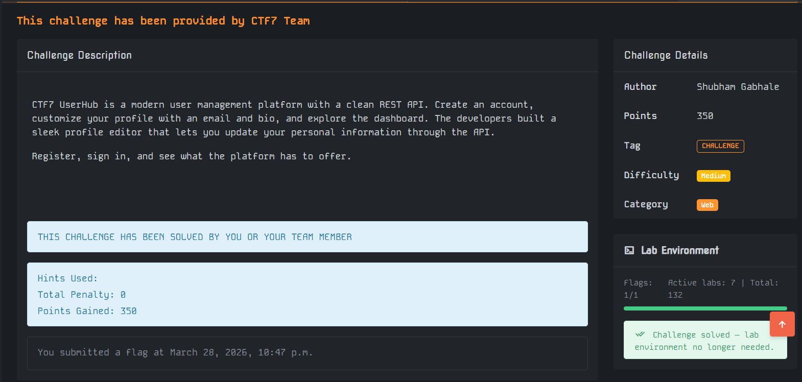

<!-- Here is the writeup for the userhub challenge -->

# Userhub

steps I took
open the lab
visit the link in browser

then we see register and login options
we created new user with username as test and password as test
then used postman to login with the username and password using the /api/login post request

then we get request on /api/profile then see the response json we get

then we send a put request to /api/profile with the json data

```
{
    "email": "test",
    "role": "admin" // this is key to change the role
}
```

then we go on the link /admin get route and see the flag on the html page recieved
